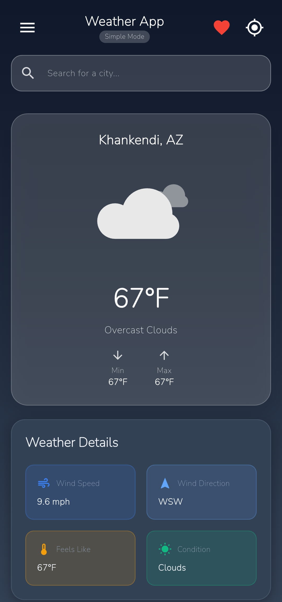
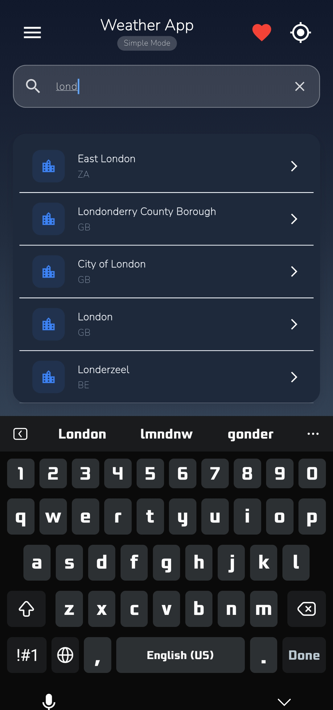
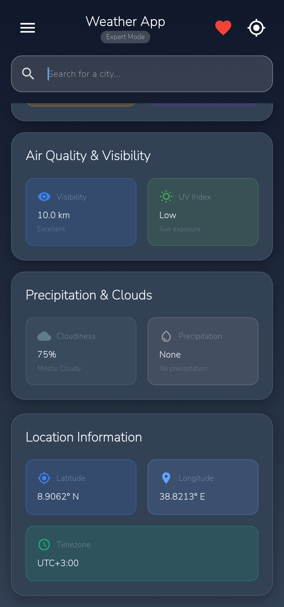
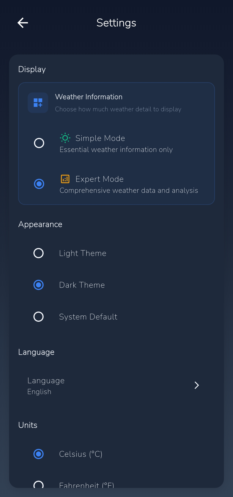

<div align="center">

# 🌤️ Weather App

### _Your Personal Weather Companion_

[](https://flutter.dev)
[](https://dart.dev)
[](https://opensource.org/licenses/MIT)

_A beautiful and intuitive weather application built with Flutter that provides accurate weather information for cities worldwide._

[📱 Features](#-features) • [🚀 Installation](#-installation) • [⚙️ Configuration](#️-configuration) • [📸 Screenshots](#-screenshots) • [🤝 Contributing](#-contributing)

---

</div>

## ✨ Features

<table>
<tr>
<td width="50%">

### 🌍 **Core Weather Features**

- 🌡️ **Real-time Weather Data** - Current temperature, humidity, wind speed
- 📍 **Location-based Weather** - Automatic current location detection
- 🔍 **Global City Search** - Search weather for any city worldwide
- 🌅 **Detailed Information** - Sunrise/sunset, pressure, visibility, UV index
- 📊 **Weather Analytics** - Comprehensive weather metrics and trends

</td>
<td width="50%">

### 🎨 **User Experience**

- 🎭 **Beautiful Animations** - Smooth Lottie weather animations
- 🌓 **Dark/Light Theme** - Adaptive themes with system sync
- 📱 **Responsive Design** - Optimized for all screen sizes
- 🎯 **Simple & Expert Modes** - Choose your preferred detail level
- ⭐ **Favorite Cities** - Save and manage your favorite locations

</td>
</tr>
</table>

### 🛠️ **Advanced Features**

| Feature                       | Description                                        | Status |
| ----------------------------- | -------------------------------------------------- | ------ |
| 🗄️ **SQLite Database**        | Local storage for favorites, history, and settings | ✅     |
| 🌐 **Multi-language Support** | 1 language supported for now                       | ✅     |
| 🌡️ **Unit Conversion**        | Celsius/Fahrenheit with automatic conversion       | ✅     |
| 📱 **Offline Support**        | Cached data for offline viewing                    | ✅     |
| 🔔 **Smart Notifications**    | Weather alerts and updates                         | ✅     |
| 📍 **Location Services**      | GPS with fallback options                          | ✅     |

---

## 📸 Screenshots

<div align="center">

| Home Screen                          | Search                                   | Expert Mode                              | Settings                                     |
| ------------------------------------ | ---------------------------------------- | ---------------------------------------- | -------------------------------------------- |
|  |  |  |  |

_Beautiful gradient backgrounds with glass-morphism effects_

</div>

---

## 🚀 Installation

### Prerequisites

- 📱 Flutter SDK (>=3.0.0)
- 🎯 Dart SDK (>=3.0.0)
- 📱 Android Studio / VS Code
- 🔧 Git

### Quick Start

# 1️⃣ Clone the repository

```bash
git clone https://github.com/yourusername/weather-app.git
cd weather-app
```

# 2️⃣ Install dependencies

```bash
flutter pub get
```

# 3️⃣ Configure API key (see configuration section)

# 4️⃣ Run the app

```bash
flutter run
```

### Platform Support

| Platform   | Status         | Version |
| ---------- | -------------- | ------- |
| 🤖 Android | ✅ Supported   | API 21+ |
| 🍎 iOS     | ✅ Supported   | iOS 12+ |
| 🌐 Web     | 🚧 In Progress | -       |
| 🖥️ Desktop | 🔮 Planned     | -       |

---

## ⚙️ Configuration

### 🔑 API Key Setup

1. **Get your API key:**

   - Visit [OpenWeatherMap](https://openweathermap.org/) 🌐
   - Create a free account
   - Generate your API key

2. **Configure the app:**

   - Create the 'constants.dart' file in lib folder

3. **Add your API key to in constants.dart:**
   ```dart
   // lib/constants.dart
   const String OPENWEATHERMAP_API_KEY = 'your_api_key_here';
   ```

### 🔒 Security Note

> ⚠️ **Important:** The `constants.dart` file is in `.gitignore` to protect your API key. Never commit API keys to version control!

### 🌍 Supported Languages

<details>
<summary>Click to expand language list</summary>

- 🇺🇸 English

</details>

---

## 📦 Dependencies

### Core Packages

| Package                                             | Version   | Purpose           |
| --------------------------------------------------- | --------- | ----------------- |
| [`http`](https://pub.dev/packages/http)             | `^1.1.0`  | API requests      |
| [`geolocator`](https://pub.dev/packages/geolocator) | `^10.1.0` | Location services |
| [`lottie`](https://pub.dev/packages/lottie)         | `^2.7.0`  | Animations        |
| [`provider`](https://pub.dev/packages/provider)     | `^6.1.1`  | State management  |
| [`sqflite`](https://pub.dev/packages/sqflite)       | `^2.3.0`  | Local database    |

### UI & Utilities

| Package                                                 | Version  | Purpose        |
| ------------------------------------------------------- | -------- | -------------- |
| [`url_launcher`](https://pub.dev/packages/url_launcher) | `^6.2.1` | External links |
| [`path`](https://pub.dev/packages/path)                 | `^1.8.3` | File paths     |

---

## 🏗️ Architecture

\`\`\`
lib/
├── 📁 components/ # Reusable UI components
├── 📁 config/ # App configuration
├── 📁 database/ # SQLite database helpers
├── 📁 models/ # Data models
├── 📁 pages/ # App screens
├── 📁 providers/ # State management
├── 📁 service/ # API services
├── 📁 theme/ # App theming
└── 📄 main.dart # App entry point
\`\`\`

### 🎨 Design Patterns

- **Provider Pattern** for state management
- **Repository Pattern** for data access
- **Singleton Pattern** for database instance
- **Factory Pattern** for model creation

---

## 🤝 Contributing

I welcome contributions! Here's how you can help:

### 🐛 Bug Reports

Found a bug? Please create an issue with:

- 📝 Clear description
- 🔄 Steps to reproduce
- 📱 Device/OS information
- 📸 Screenshots (if applicable)

### ✨ Feature Requests

Have an idea? I'd love to hear it!

- 💡 Describe the feature
- 🎯 Explain the use case
- 🎨 Include mockups (if available)

### 🔧 Pull Requests

1. Fork the repository
2. Create a feature branch
3. Make your changes
4. Add tests (if applicable)
5. Submit a pull request

---

## 📄 License

\`\`\`
MIT License

Copyright (c) 2025 SENTACK

Permission is hereby granted, free of charge, to any person obtaining a copy
of this software and associated documentation files (the "Software"), to deal
in the Software without restriction, including without limitation the rights
to use, copy, modify, merge, publish, distribute, sublicense, and/or sell
copies of the Software, and to permit persons to whom the Software is
furnished to do so, subject to the following conditions:

The above copyright notice and this permission notice shall be included in all
copies or substantial portions of the Software.
\`\`\`

---

<div align="center">

## 🌟 Show Your Support

If you found this project helpful, please consider:

[](https://github.com/sentack/minimal_weather_app)
[](https://github.com/sentack/minimal_weather_app/fork)
[](https://twitter.com/intent/tweet?text=Check%20out%20this%20amazing%20Flutter%20Weather%20App!)

### 👨‍💻 Made with ❤️ & ☕ by [SENTACK](https://sentack-portfolio.vercel.app/)

_Building beautiful mobile experiences, one app at a time._

---

**Version 2.1.0** • **Last Updated: July 2025**

</div>
